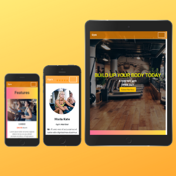

# User Centric Front-End Project - Code Institute

This is a Gym webpage with a sales-funnel and copywrit layout.
 
 
 
## UX

The website is made ultimately for gym, to grab the user attention and show them the value they will receive from the company.
With the contrast of differnt worm colors such as orange it gives the feeling of warmt, confort and welcome to the user.
Moreover, different sections are used such as features to give the user sure to become a member. 
 
### Goal

-The main goal is to make visitors subscribe.

### Pages

##### Landing page

The landing page is made with different purposes, to grab the user attention and take action in terms of subscription.

The Button (Subscribe Now) Brings the user to a Google forms page, where the Gym company can follow up with its lead.

##### Features

The feature section is mainly developed to detail what are the features the company has and what are their price.

##### Testimonials

The testimonial section is the section in which the gym has a more personal approach with the website user. 
Two different users and a personal trainer left their terstimony to detail their experience, succes history and impressions with the gym.
So, future users may remove their objections and subscribe/join the Gym service. 

#### Main Colors used

- > #fff : White - Mainly used to beautify words.
- > #ff8c00 : Used as rgb(255, 140, 0) on navbar as a worm color.
- > #fa709a :
- > #fee140 :
- > #3a3e42 : 
- > #d8d0b8 : 

##### Linear gradients

- > Features : background-image: linear-gradient(to right, #fa709a 0%, #fee140 100%); A worm and strong color to keep the attention throught the website and feel welcome as well as triggered to be part of the gym.
- > Video Section : background-image: linear-gradient(120deg, #f6d365 0%, #fda085 100%); A worm but different linear gradient from the feature section. It was made purpositaly to keep the attention of the reader and not keep he or she tired. 
- > footer : background-image: linear-gradient(-20deg, #2b5876 0%, #4e4376 100%); different from the entire section. A could color to contrast and bring the attention to the reader.
 

### Features Left to Implement

- Another feature that I am learning and I would like to implement is a emailed follow-up for high-ticket sales. 
- Once a user is subscribed and/or member of the gym, the follow up can bring them to different levels of value within the company until reach the high-ticket sale.
- Which could be a personal-trainer or a high-level training bootcamp costing €1000+.

## Technologies Used

In this section, you should mention all of the languages, frameworks, libraries, and any other tools that you have used to construct this project. For each, provide its name, a link to its official site and a short sentence of why it was used.

- [HTML](https://html.com/)
    - The project uses **HTML** to structure the website content.
    
- [CSS](https://developer.mozilla.org/en-US/docs/Web/CSS)
    - The project uses **CSS** to style the website bringing more meaning and beauty for its content.

- [Bootstrap](https://getbootstrap.com/)
    - The project uses **Bootstrap** a CSS framework used to develop responsive and mobile-first websites.
    
## Testing

The work was tested in many different real and virtual screens. 

- Phones:

   - Galaxy S5
   - Pixel 2
   - Pixel 2XL
   - iPhone 5/SE
   - iPhone 6/7/8
   - iPhone 6/7/8 Plus (virtual and real device)
   - iPhone X

- Tablets:

   - iPad
   - iPad Pro
 
- Desktops:

   - ThinkPad x1 Carbon
   
- Television
  
   - 4k Television (real device)

### How the website was tested?

I used the Chrome developer tool to test the website in different screens and my iPhone 6 to know whether the outcomes were working. I tryed different websites to try different screens, however not having the real outcome.
Bear in mind that I just used Chrome Developer Tools to test virtually different screens.

In this section, you need to convince the assessor that you have conducted enough testing to legitimately believe that the site works well. Essentially, in this part you will want to go over all of your user stories from the UX section and ensure that they all work as intended, with the project providing an easy and straightforward way for the users to achieve their goals.

Whenever it is feasible, prefer to automate your tests, and if you've done so, provide a brief explanation of your approach, link to the test file(s) and explain how to run them.

For any scenarios that have not been automated, test the user stories manually and provide as much detail as is relevant. A particularly useful form for describing your testing process is via scenarios, such as:

1. Contact form:
    1. Go to the "Contact Us" page
    2. Try to submit the empty form and verify that an error message about the required fields appears
    3. Try to submit the form with an invalid email address and verify that a relevant error message appears
    4. Try to submit the form with all inputs valid and verify that a success message appears.

In addition, you should mention in this section how your project looks and works on different browsers and screen sizes.

You should also mention in this section any interesting bugs or problems you discovered during your testing, even if you haven't addressed them yet.

If this section grows too long, you may want to split it off into a separate file and link to it from here.

## Deployment

This section should describe the process you went through to deploy the project to a hosting platform (e.g. GitHub Pages or Heroku).

In particular, you should provide all details of the differences between the deployed version and the development version, if any, including:
- Different values for environment variables (Heroku Config Vars)?
- Different configuration files?
- Separate git branch?

In addition, if it is not obvious, you should also describe how to run your code locally.

## Credits

### Content
- The text for section Y was copied from the [Wikipedia article Z](https://en.wikipedia.org/wiki/Z)

### Media
- The photos used in this site were obtained from ...

### Acknowledgements

- I received inspiration for this project from X